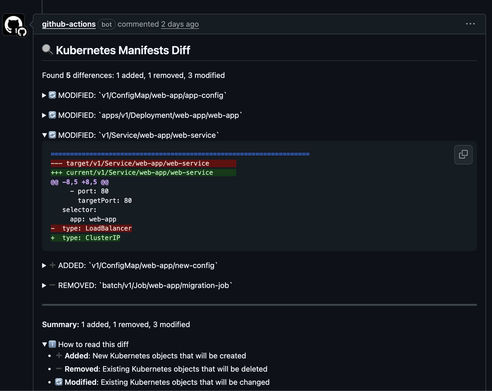

# Kubernetes Manifests Diff Action

A GitHub Action that compares Kubernetes manifests, showing detailed diffs for
each object. It is meant to be used in pull requests to help developers
understand changes in Kubernetes resources between branches.

This action can be used with both Helm templates and Kustomize builds, allowing
you to generate manifests from your current branch and a target branch (e.g.,
the base branch of a pull request) and compare them.

See the [example workflow](#usage) below for an example of how to set it up in
your GitHub Actions.

## Features

- Compares individual Kubernetes objects between branches
- Shows added, removed, and modified objects
- Supports both Helm template and Kustomize build outputs
- Excludes objects with no differences from results

## Usage

```yaml
name: Compare Manifests
on: [pull_request]

jobs:
  compare:
    runs-on: ubuntu-latest
    steps:
      # Checkout current branch
      - name: Checkout current branch
        uses: actions/checkout@v4
        with:
          path: current

      # Checkout target branch
      - name: Checkout target branch
        uses: actions/checkout@v4
        with:
          ref: ${{ github.base_ref }}
          path: target

      # Generate manifests for current branch
      - name: Generate current manifests
        run: |
          # Example with Helm
          helm template ./current/chart > current-manifests.yaml
          # Or with Kustomize
          # kustomize build ./current/overlay > current-manifests.yaml

      # Generate manifests for target branch
      - name: Generate target manifests
        run: |
          # Example with Helm
          helm template ./target/chart > target-manifests.yaml
          # Or with Kustomize
          # kustomize build ./target/overlay > target-manifests.yaml

      # Compare manifests
      - name: Compare manifests
        uses: revyy/manifests-diff-action@v1.0.0
        with:
          current_manifests_path: current-manifests.yaml
          target_manifests_path: target-manifests.yaml
          github_token: ${{ secrets.GITHUB_TOKEN }}
```

### Example Comment



## Inputs

| Input                    | Description                                                      | Required | Default               |
| ------------------------ | ---------------------------------------------------------------- | -------- | --------------------- |
| `current_manifests_path` | Path to the file containing manifests from the current PR branch | Yes      |                       |
| `target_manifests_path`  | Path to the file containing manifests from the target branch     | Yes      |                       |
| `github_token`           | GitHub token for posting comments                                | No       | `${{ github.token }}` |

## Object Identification

Objects are identified by their unique key:
`{apiVersion}/{kind}/{namespace}/{name}`

## Output

One or more comments posted in the pull-request detailing the differences.

## Development

1. Install dependencies: `npm install`
2. Build the action: `npm run all`

### Publishing a New Release

This project includes a helper script, [`script/release`](./script/release)
designed to streamline the process of tagging and pushing new releases for
GitHub Actions.

GitHub Actions allows users to select a specific version of the action to use,
based on release tags. This script simplifies this process by performing the
following steps:

1. **Retrieving the latest release tag:** The script starts by fetching the most
   recent SemVer release tag of the current branch, by looking at the local data
   available in your repository.
1. **Prompting for a new release tag:** The user is then prompted to enter a new
   release tag. To assist with this, the script displays the tag retrieved in
   the previous step, and validates the format of the inputted tag (vX.X.X). The
   user is also reminded to update the version field in package.json.
1. **Tagging the new release:** The script then tags a new release and syncs the
   separate major tag (e.g. v1, v2) with the new release tag (e.g. v1.0.0,
   v2.1.2). When the user is creating a new major release, the script
   auto-detects this and creates a `releases/v#` branch for the previous major
   version.
1. **Pushing changes to remote:** Finally, the script pushes the necessary
   commits, tags and branches to the remote repository. From here, you will need
   to create a new release in GitHub so users can easily reference the new tags
   in their workflows.

### Dependency License Management

This template includes a GitHub Actions workflow,
[`licensed.yml`](./.github/workflows/licensed.yml), that uses
[Licensed](https://github.com/licensee/licensed) to check for dependencies with
missing or non-compliant licenses.

#### Updating Licenses

Whenever you install or update dependencies, you can use the Licensed CLI to
update the licenses database. To install Licensed, see the project's
[Readme](https://github.com/licensee/licensed?tab=readme-ov-file#installation).

To update the cached licenses, run the following command:

```bash
licensed cache
```

To check the status of cached licenses, run the following command:

```bash
licensed status
```
